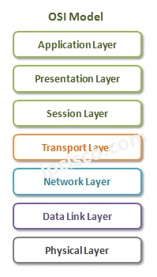
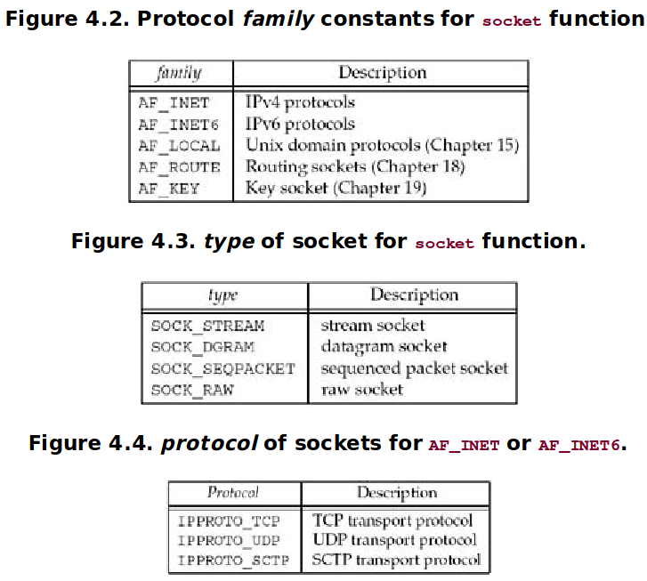
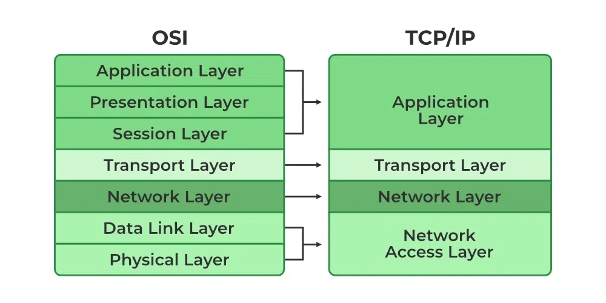

# PIPELINE - FILE I/O:

Header file :
```
#ifndef TLPI_HDR_H
#define TLPI_HDR_H /* Prevent accidental double inclusion */
#include <sys/types.h> /* Type definitions used by many programs */
#include <stdio.h> /* Standard I/O functions */
#include <stdlib.h> /* Prototypes of commonly used library functions,
plus EXIT_SUCCESS and EXIT_FAILURE constants */
#include <unistd.h> /* Prototypes for many system calls */
#include <errno.h> /* Declares errno and defines error constants */
#include <string.h> /* Commonly used string-handling functions */
#include "get_num.h" /* Declares our functions for handling numeric
arguments (getInt(), getLong()) */
#include "error_functions.h" /* Declares our error-handling functions */
typedef enum { FALSE, TRUE } Boolean;
#define min(m,n) ((m) < (n) ? (m) : (n))
#define max(m,n) ((m) > (n) ? (m) : (n))
#endif
```

Lệnh: 
```
fd = open(pathname, flags, mode) .  If the file
doesn’t exist, open() may create it

numread = read(fd, buffer, count) reads at most count bytes from the open file
referred to by fd and stores them in buffer. The read() call returns the number of
bytes actually read. If no further bytes could be read (i.e., end-of-file was
encountered), read() returns 0.

numwritten = write(fd, buffer, count) writes up to count bytes from buffer to the
open file referred to by fd. The write() call returns the number of bytes actually
written, which may be less than count.

status = close(fd) is called after all I/O has been completed, in order to release
the file descriptor fd and its associated kernel resources


```

Flag Open: 




0_EXCL: đi chung với 0_CREAT để tạo 1 file, khi ban đầu sẽ kiểm tra xem file có tồn tại không, nếu có sẽ không cho phép mở

0_APPEND: đảm bảo wr từ điểm cuối của file tránh trường hợp nhiều ng cùng wr

0_NONBLOCK: use trong TH FIFOs, 

(part1: file access, part2: file creation, part3: open file status)

truncating to zero (nội dung file chỉ còn trên file system trong code thì k): 0_TRUNC

```
/* Open new or existing file for reading and writing, truncating to zero
bytes; file permissions read+write for owner, nothing for all others */
fd = open("myfile", O_RDWR | O_CREAT | O_TRUNC, S_IRUSR | S_IWUSR);
if (fd == -1)
errExit("open");
/* Open new or existing file for writing; writes should always
append to end of file */
fd = open("w.log", O_WRONLY | O_CREAT | O_TRUNC | O_APPEND,
S_IRUSR | S_IWUSR);
if (fd == -1)
errExit("open");
```

File descriptor: 


Read:
```
ssize_t read(int fd, void *buffer, size_t count);
Returns number of bytes read, 0 on EOF, or –1 on error
```

Lưu ý khi read:
```
char buffer[MAX_READ + 1];
ssize_t numRead;
numRead = read(STDIN_FILENO, buffer, MAX_READ);
if (numRead == -1)
errExit("read");
buffer[numRead] = '\0';
printf("The input data was: %s\n", buffer);
Because the terminating null byte requires a byte of memory, the size of buffer must
be at least one greater than the largest string we expect to read.
```

Lseek: pointer đến vị trí trong file


fcntl: chỉnh sửa thay dôi mode access của file đang mở. The flags that can be modified are O_APPEND, O_NONBLOCK, O_NOATIME, O_ASYNC, and
O_DIRECT.

Quy tắc:

 Two different file descriptors that refer to the same open file description share
a file offset value. Therefore, if the file offset is changed via one file descriptor
(as a consequence of calls to read(), write(), or lseek()), this change is visible
through the other file descriptor. This applies both when the two file descrip-
tors belong to the same process and when they belong to different processes.

Similar scope rules apply when retrieving and changing the open file status
flags (e.g., O_APPEND, O_NONBLOCK, and O_ASYNC) using the fcntl() F_GETFL and F_SETFL
operations.

By contrast, the file descriptor flags (i.e., the close-on-exec flag) are private to
the process and file descriptor. Modifying these flags does not affect other file
descriptors in the same process or a different process.

Dup: lặp lại 1 file descriptor. 

VD:
```
close(2); /* Frees file descriptor 2 */
newfd = dup(1); /* Should reuse file descriptor 2 */
```

```
int dup2(int oldfd, int newfd); : đóng newfd r sẽ dup oldfd sang newfd
int dup3(int oldfd, int newfd, int flags); : thêm option so với dup2
```

Nên dùng pread, pwrite tránh race condition
```
ssize_t pread(int fd, void *buf, size_t count, off_t offset);
ssize_t pwrite(int fd, const void *buf, size_t count, off_t offset);
```

Scatter Gather I/O: chuyển nhiều buffer trong 1 lần chuyển duy nhất. Lưu vào trong 1 iov

```
struct iovec {
void *iov_base; /* Start address of buffer */
size_t iov_len; /* Number of bytes to transfer to/from buffer */
};
ssize_t preadv(int fd, const struct iovec *iov, int iovcnt, off_t offset);
ssize_t pwritev(int fd, const struct iovec *iov, int iovcnt, off_t offset);
```

Truncate:
```
int truncate(const char *pathname, off_t length);
int ftruncate(int fd, off_t length); 

set the size of file to the value length
```

File tạm: 
```
int mkstemp(char* template);
```

Process ID: 
```
pid_t getpid(void); : giới hạn 32767 tới giới hạn sẽ reset.
```

# Socket:

Cấu trúc Ipv4 socket address:


Cấu trúc 1 socket thông thường:


```
int bind(int, struct sockaddr *, socklen_t); : trỏ tới 1 địa chỉ socket
VD:
struct sockaddr_in serv;
bind(sockfd, (struct sockaddr *) &serv, sizeof(serv));
```

Cấu trúc địa chỉ IPv6:


Three functions, bind,connect, and sendto, pass a socket address structure from the
process to the kernel.

```
connect(sockfd, (SA* )&serv, sizeof(serv));
```

Four functions, accept,recvfrom,getsockname, and getpeername, pass a socket
address structure from the kernel to the process
```
struct sockaddr_un cli; 
socklen_t len;
len = sizeof(cli); 
getpeername(unixfd, (SA *) &cli, &len);
```

Consider a 16-bit integer that is made up of 2 bytes. There are two ways to store the two
bytes in memory: with the low-order byte at the starting address, known as little-endian byte
order, or with the high-order byte at the starting address, known as big-endian byte order.

Little-endian: càng về sau tốn càng ít, big-endian: càng về sau tốn càng nhiều bộ nhớ

```
void bzero(void *dest,size_tnbytes); : set specific number of bytes to zero in dest, thường dùng để initialize socket add
void bcopy(const void *src,void *dest,size_tnbytes); : move specific number of bytes from src to dest
int bcmp(const void *ptr1,const void *ptr2,size_tnbytes); : so sánh 2 chuỗi. trả về 0 nếu giống 1 nếu khác
```

```
void *memset(void *dest,intc,size_tlen); : set the specific number of byte to C
void *memcpy(void *dest,const void *src,size_tnbytes); : sao chép nhưng pointer 2 add sẽ hoán đổi
int memcmp(const void *ptr1,const void *ptr2,size_tnbytes); : 
```

```
int inet_aton(const char *strptr,struct in_addr *addrptr); : chuyển kí tự trỏ bởi strptr thành 32-bit binary, trả về 1 nếu chuyển dc
in_addr_t inet_addr(const char *strptr); : trả về 32-bit binary của của dc ipv4
char *inet_ntoa(struct in_addrinaddr); : chuyển ngược từ 32-bit binary thành kiểu string
```

```
int inet_pton(int family,const char *strptr,void *addrptr); : trả về 1 nếu chuyển dữ liệu trỏ trong strptr thành binary và lưu trong addrptr
const char *inet_ntop(intfamily,const void *addrptr,char *strptr,size_tlen); : quá trình ngược lại 
```
sock_nton: cũng quá trình chuyển string sang binary nhưng trong TH muốn k phụ thuộc protocol IPv4 hay IPv6
```
ssize_t readn(intfiledes,void *buff,size_tnbytes); : read n bytes from descriptors

ssize_t writen(intfiledes,const void *buff,size_tnbytes); : write n bytes to file descriptors

ssize_t readline(intfiledes,void *buff,size_tmaxlen); : read a text line from a descriptor, one byte at a time
```

# TCP Socket: 


TCP using Ipv4, UDP : IPv6, 

```
int socket (intfamily,inttype,intprotocol); : khởi tạo socket, xác định những phương thức giao tiếp
```


Connect: 
```
int connect(intsockfd,const struct sockaddr *servaddr,socklen_taddrlen); 
```

Client k nhất thiết phải bind, 3 way handshake

Bind: cung cấp 1 địa chỉ local cho socket. Kernel sẽ tự thực hiện việc chọn port cho socket 
```
int bind (intsockfd,const struct sockaddr *myaddr,socklen_taddrlen);
```

Listen: khi socket đã được tạo, nó cần dc xác định là 1 socket khả dụng. chuyển trạng thái unactive sang active socket, backlog là số lượng ng truy cập vào socket tối đa
```
int listen (intsockfd,intbacklog); :
```

Accept: is called by a TCP server to return the next completed connection from the front of the
completed connection queue (Figure 4.7). If the completed connection queue is empty, the
process is put to sleep
```
int accept (intsockfd,struct sockaddr *cliaddr,socklen_t *addrlen); 
```

Fork: 
```
pid_t fork(void);
```
t returns once in the calling process (called the parent) with a
return value that is the process ID of the newly created process (the child). It also returns
once in the child, with a return value of 0. Hence, the return value tells the process whether it
is the parent or the child.

Thông thường có 2 chức năng của fork: 

_ Tạo 1 bản sao của process để 1 process thực hiện task hiện tại 1 process thực hiện task khác. 

_ Process trong quá trình thực hiện muốn thực hiện 1 task nhỏ trong program khác, nó sẽ tạo 1 copy với fork và dùng exec để thực hiện trong 1 chương trình khác.

Exec: 
```
int execl (const char *pathname,const char *arg0, ... /* (char *) 0 */ );
int execv (const char *pathname,char *constargv[]);
int execle (const char *pathname,const char *arg0, ...
/* (char *) 0, char *constenvp[] */ );
int execve (const char *pathname,char *constargv[], char *constenvp[]);
int execlp (const char *filename,const char *arg0, ... /* (char *) 0 */ );
int execvp (const char *filename,char *constargv[]);
```



Concurrent Server (multiple clients):

Close:
```
int close (intsockfd);
```

Getsockname, getpeername:

```
int getsockname(intsockfd,struct sockaddr *localaddr,socklen_t *addrlen); : trả về local port number đã đăng kí
int getpeername(intsockfd,struct sockaddr *peeraddr,socklen_t *addrlen); : IP address và port của client
```