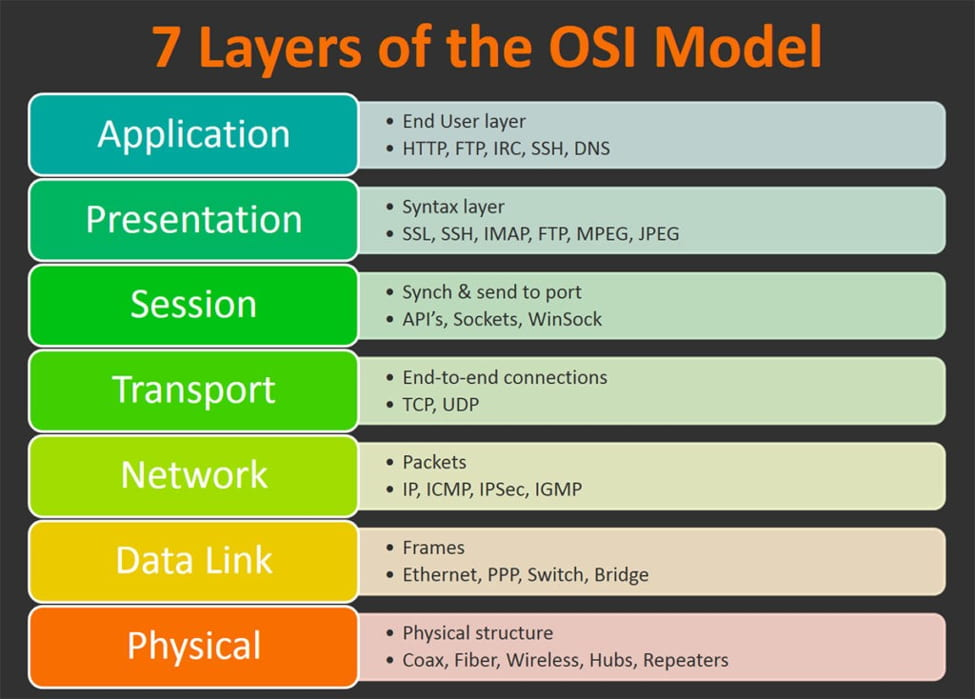
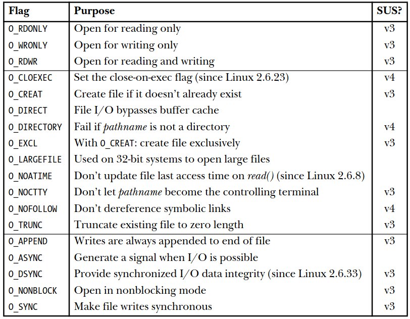
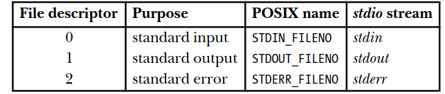
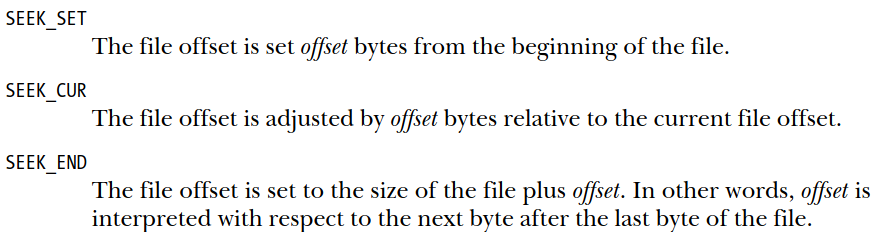
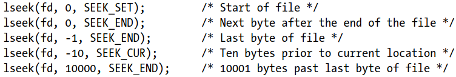
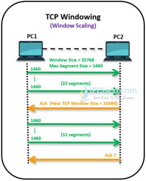
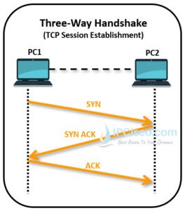
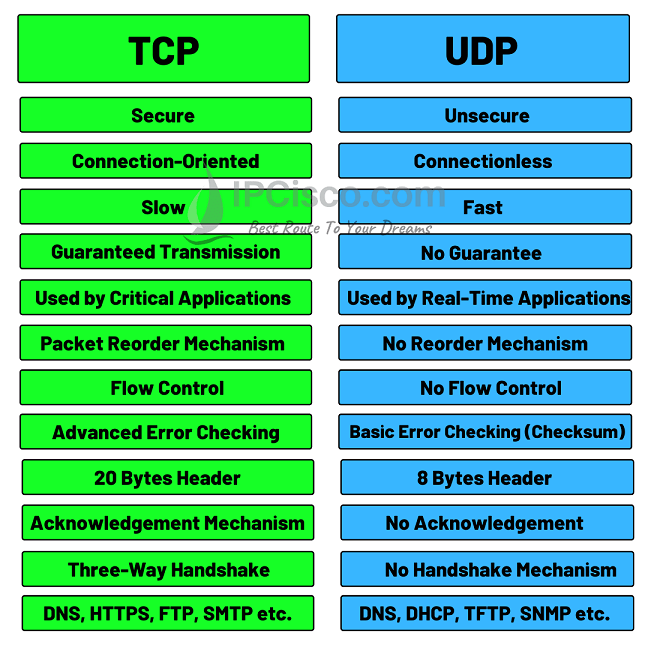
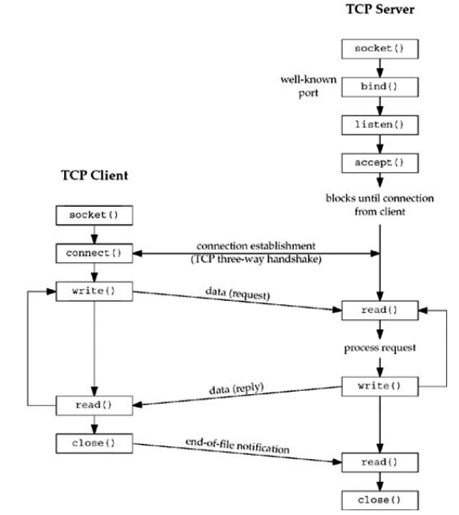

## OSI - LAN - WAN - TCP/IP Network:
#
1. Tổng quan OSI:

Mô hình OSI gồm 7 lớp chia ra làm 2 nhóm. 4 lớp bên dưới gọi là lớp thấp và 3 lớp bên trên gọi là lớp cao.

* Lớp 1 Physical Layer:

Đây là lớp thực sự kết nối giữa diểm phát và điểm kết thúc. Đây là lớp mà các đặc tính của network được xác định và chuyển đổi bit được hoàn tất. Những bit này được cho là 1 signal. Về mặt cơ bản, đây là lớp mà các bit được truyền theo nhiều cách như network cable hay giao tiếp thông qua các hub. Các  tín hiệu điện tử được dùng với kết nối có dậy và tín hiệu dạng radio được dùng với các kết nối không dây.

* Lớp 2 Data-Linker:

Đây là lớp trung gian trong việc truyền dữ liệu. Nó xác định cách định dạng data được truyền đi bởi lớp physical. Lớp này cung cấp kết nối node-to-node, được biết đến là lớp của địa chỉ MAC(bộ nhớ chỉ đọc của card mạng(NIC), địa chỉ phần cứng Ethernet (EHA)).  
Lớp naỳ đóng gói dữ liệu thành layer 2 head và layer 2 tail. Data sau khi kết hợp head và  tail gọi là 1 frame. Do đó, nó chịu trách nhiệm tìm điểm đích kế tiếp của mạng. Ngoài ra, nó cũng cung cấp cơ chế xác định lỗi truyền  
Data Link có 2 lớp con là MAC Layer(MAC) và Logical Layer(LLC).
* MAC sẽ điều khiển cách máy tính trên mạng có thể tiếp cận được dữ liệu và cấp quyền để truyền tải nó
* LLC chịu trách nhiệm quản lý frame lên hay xuống, kiểm tra flow và lỗi.

Một trong những thiết bị nổi bật ở lớp 2 này là Layer 2 Switch. Switch thường được ứng dụng trong mạng LAN, có nhiệm vụ nhận dữ liệu truyền đến và xác định đường truyền sau đó.

Ethernet cũng là 1 phương thức phổ biến trong lớp Data link. 1 số phương thức khác như PPP, HDLC, FDDI, ATM, Frame Relay.

* Lớp 3 Network:

Đây là lớp của địa chỉ, quyết định địa chỉ ip của điểm đích. với việc làm vậy, nó có thể kết nối với các mạng khác nhau. Những địa chỉ này có thể là Ipv4 hoặc Ipv6.

Lớp network chịu trách nhiệm cho việc định tuyến, với việc xác định đường đi của các gói dữ liệu, xác định những router mà dữ liệu sẽ đi qua. 

Layer3 head sẽ được thêm vào data trong lớp này. frame khi này sẽ trở thành 1 packet. Những giao thức sẽ được xác định thông qua head này như TCP, UDP, SCTP. Nếu 1 frame dài hơn MTU (maximum tranmission unit), nó sẽ bị chia thành các packet nhỏ. 

Một vài phương thức được sử dụng để định tuyến trong lớp này có thể kể đến là IPv4, IPv6, ICMP, IPSec, OSPF, BGP,..

* Lớp 4 Transport: 

Đây là lớp hình thành, quản lý end-to-end kết nối bảo mật. Lớp này chịu trách nhiệm cho việc phục hồi lỗi và kiểm soát hướng truyền. Lớp nay sẽ thêm 1 layer4 header vào packet. Khi này, nó sẽ dược gọi là 1 segment.

Có 2 phương thức chủ yếu là UDP và TCP, 1 số phương thức truyền tải khác như SCTP, RSVP, nhưng chủ yếu vẫn là UDP và TCP. 

* Lớp 5 Session:

Đây là lớp chịu trách nhệm cho việc truyền tải ở những lớp sau cùng. Nó hình thành, quản lý 1 session. Đăng nhập vào network cũng được hoàn thành trong lớp này. 

Tóm gọn lại đây là 1 lớp thuộc về Application và cung cấp người dùng 1 khả năng truy cập vào mạng hay 1 thiết bị trong hệ thống truyền tải.

* Lớp 6 Presentation: 

Đây là lớp Phiên dịch của 1 mạng. Chuyển đổi những data thành 1 cấu trúc file mà người dùng có thể dễ dàng tiếp cận. Như jpeg và gif đối với image; mp3, mp4 đối với video. 

Giải mã và nén dữ liệu là hoạt động chủ yếu ở lớp này.

* Lớp 7 Application:

Đây là lớp gần nhất với người dùng. Đây là lớp tương tác giữa ứng dụng và các lớp bên dưới. Một vài giao thức được sử dụng trong lớp  này: Telnet, FTP, SMTP, HTTPS, SSL,..

2. TCP/IP Network: 

.
https://www.cisco.com/c/en/us/support/docs/ip/routing-information-protocol-rip/13769-5.html

3. LAN:

https://www.cisco.com/c/en/us/products/switches/what-is-a-lan-local-area-network.html

4. WAN:

https://www.cisco.com/c/en/us/products/switches/what-is-a-wan-wide-area-network.html

## Transport Layer_TCP Protocol_UDP Protocol:
#
