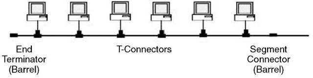
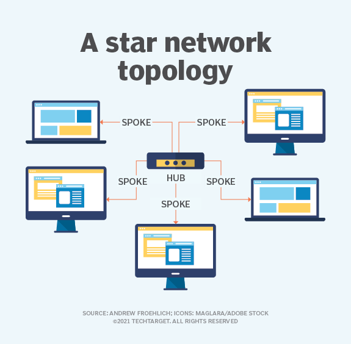
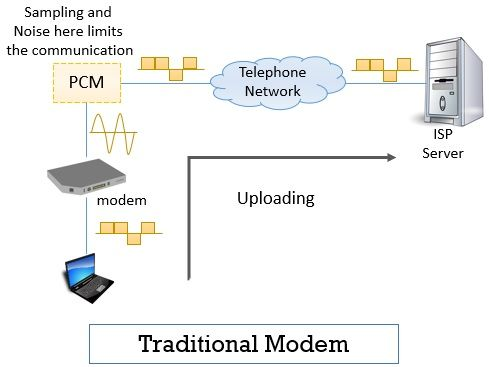

## OSI - LAN - WAN - TCP/IP Network:
#

1. Mô hình OSI:

OSI(Open System Interface) là 1 mô hình diễn tả cách để thông tin từ phần mềm của 1 máy tính truyền qua phần mềm ở máy tính khác thông qua 1 lớp vật lý. Mô hình được ra đời năm 1984 và trở thành mô hình mang tính kiến trúc, được sử dụng chủ yếu trong học thuật để hiểu về vấn đề. Mô hình gồm 7 lớp. 

* Lớp Physical:

 Tầng vật lý là hạ tầng cơ sở của mạng truyền thông, cung cấp phương tiện truyền tín hiệu thô sơ ở dạng bit.

Thông thuồng sẽ có 2 loại kết nối là Guided Media và Unguided media:
*  With guided
media, the waves are guided along a solid medium, such as a fiber-optic cable, a twisted-pair copper
wire, or a coaxial cable. 
* With unguided media, the waves propagate in the atmosphere and in outer
space, such as in a wireless LAN or a digital satellite channel.

Một số Guided Media (cáp) thông thường sử dụng:

* Twisted-pair copper wire: Đây là loại rẻ nhất và thông thường đươc sử dụng hiện tại. Data rates for
LANs using twisted pair today range from 10 Mbps to 10 Gbps. Được sử dụng trong kết nối mạng LAN hay trong công nghệ DSL 
* Coaxial Cable: Thường được sử dụng nhiều trong cáp TV hay cáp kết nối Internet, tốc độ đạt được 10Mbps

* Fiber Optics: An optical fiber is a strand of glass that is as thin as a human hair. This strand is designed to carry information using pulses of light emitted by a laser. An optical fiber is a complex structure that consists of three layers.

https://www.coherent.com/news/glossary/optical-fibers

Một số Unguided Media thông thường được sử dụng:
* Terrestrial radio channels can be broadly classified into three groups: those that operate over very short
distance (e.g., with one or two meters); those that operate in local areas, typically spanning from ten to a few hundred meters.
* Sattelite Radio Channels: A communication satellite links two or more Earth-based microwave transmitter/ receivers, known as
ground stations. There are 2 types: geostationary satellites and low-earth orbiting. 

#

* Lớp Data-Link:

Lớp này đảm bảo cho thông tin truyền tải từ network-layer datagram mà không xảy ra lỗi. Nó cung cấp các phương thức đáng tin cậy để giao tiếp giữa các device. Nó chịu trách nhiệm cho việc định danh các thiết bị khi làm việc trên mạng LAN.

Các nhiệm vụ chính của lớp Data-link là:

* **Framing**: Almost all link-layer protocols encapsulate each network-layer datagram within a link-layer
frame before transmission over the link. A frame consists of a data field, in which the network-layer
datagram is inserted, and a number of header fields.
* **Link access**: A medium access control (MAC) protocol specifies the rules by which a frame is
transmitted onto the link. For point-to-point links that have a single sender at one end of the link and
a single receiver at the other end of the link, the MAC protocol is simple (or nonexistent)—the sender
can send a frame whenever the link is idle. 
* **Reliable delivery**: When a link-layer protocol provides reliable delivery service, it guarantees to
move each network-layer datagram across the link without error. Recall that certain transport-layer
protocols (such as TCP) also provide a reliable delivery service. Similar to a transport-layer reliable
delivery service, a link-layer reliable delivery service can be achieved with acknowledgments and
retransmissions
* **Error Control**: Error control is achieved by adding a calculated value CRC (Cyclic Redundancy Check) that is placed to the Data link layer's trailer which is added to the message frame before it is sent to the physical layer. If any error seems to occurr, then the receiver sends the acknowledgment for the retransmission of the corrupted frames. 

Một số ví dụ về các thiết bị và công nghệ ở lơp DataLink: 

_ PON:

#
* Lớp Network:

Đây là lớp xác định địa chỉ lớp 3 của các thiết bị, xác định vị trí các thiết bị trên mạng lưới. Nó cũng xác định đường đi ngắn nhất dựa vào các điều kiện của mạng lưới. Phương thức chủ yếu trong lớp này là ip và ipv6. Hai nhiệm vụ chính của lớp này là:

* **Forwarding**. When a packet arrives at a router’s input link, the router must move the packet to the
appropriate output link. 
* **Routing**. The network layer must determine the route or path taken by packets as they flow from a
sender to a receiver.

2 nhiệm vụ này được thực hiện thông qua forwarding table với 2 tác vụ khác là Control plane (routing) và Data plane (forwarding).

https://blog.ipspace.net/2013/08/management-control-and-data-planes-in.html

Mục đích cần phải đạt được trong lớp này là:

_ **Guaranteed delivery**. This service guarantees that a packet sent by a source host will eventually
arrive at the destination host.

_ **Guaranteed delivery with bounded delay**. This service not only guarantees delivery of the packet,
but delivery within a specified host-to-host delay bound (for example, within 100 msec).

_ **In-order packet delivery**. This service guarantees that packets arrive at the destination in the order
that they were sent.

_ **Guaranteed minimal bandwidth**. This network-layer service emulates the behavior of a
transmission link of a specified bit rate (for example, 1 Mbps) between sending and receiving hosts.
As long as the sending host transmits bits (as part of packets) at a rate below the specified bit rate,
then all packets are eventually delivered to the destination host.

_ **Security**. The network layer could encrypt all datagrams at the source and decrypt them at the
destination, thereby providing confidentiality to all transport-layer segments.

2 thiết bị phổ biến sử dụng trong lớp này là Router và Switch layer-3

#
* Lớp Transport: 

Nhiệm vụ chính của lớp này là đảm bảo dữ liệu được truyền đi hoàn toàn. Nó nhận dữ liệu từ các lớp trên và chuyển thành dữ liệu nhỏ hơn gọi là segments.

2 phương thức chủ yếu trong lớp này là TCP và UDP:

_ TCP (Transmission Control Protocol): phương thức tiêu chuẩn để hệ thống có thể kết nối với Internet, và giao tiếp giữa các host. Các segments đươc chuyển dịch qua Internet theo nhiều đường đi và các trật tự khác nhau để đến điểm đích. Lớp này sẽ tiếp tục định hướng đường đi kế tiếp của packet. 
_ UDP (User Datagram Protocol): Đây là phương thức không đáng tin cậy 

Chức năng của lớp Transport:

_ **Service-point addresssing**: máy tính có thể chạy nhiều chương trình cùng lúc, dữ liệu sẽ được truyền không chỉ là từ máy này sang máy khác mà có thể từ process này sang process khác. Lớp transport sẽ thêm vào header 1 địa chỉ gọi là service-point address hay là port address. 
_ **Segmentation and reassembly**: khi lớp Transport nhận được dữ liệu từ cac lớp trên, chúng sẽ chia dữ liệu thành các segments nhỏ với các số đại diện cho các segment đó. Khi dữ liệu đến đích, các segments sẽ được tái kết hợp dựa trên số đại diện. 
_ **Connection Control**: Transport layers cung cấp 2 dịch vụ là Connection-oriented và Connectionless. Connectionless sẽ xem các segment là các packet riêng biệt và truyền đến điểm đích. Connection-oriented sẽ kết nối với điểm đích trước rồi mới truyền các packets. 
_ **Flow Control**: Chịu trách nhiệm cho việc truyền tải end-to-end.  
_ **Error Control**: Lớp transport sẽ đảm bảo dữ liệu sẽ truyền đến điểm đích mà không xảy ra lỗi.

* Lớp Session:

Đây là lớp công bố, duy trì, động bộ 2 process đang truyền dữ liệu với nhau. Quá trình công bố sự truy cập giống như 1 quá trình log in

Chức năng của lớp Session:  
_ **Dialog Control**: Nó sẽ tạo ra 1 hộp thoại giao tiếp giữa các process
 
_ **Synchronization**: Lớp session sẽ thêm 1 checkpoint để kiểm tra. Nếu có lỗi diễn ra trong quá trình truyền, việc truyền sẽ được khởi động lại tại thời điểm checkpoint. Quá trình này được gọi là Synchronization and recovery.

* Lớp Presentation: 

Lớp này sẽ xác định các vấn đề về syntax và semantics của thông tin chuyển giữa 2 systems. Nó làm việc như 1 bộ giải mã thông tin và chuyển data từ 1 dạng file này sang file khác.

Chức năng của lớp Presentation:

_**Translation**: Process trong 2 hệ thống sẽ chuyển giao thông tin với nhau theo 1 form nhất định.  
_**Encryption**: Đây là hoạt động cần thiết để duy trì bảo mật. Mã hóa là quá trình chuyển form dữ liệu gốc sang 1 form khác thuận tiện cho việc truyền thông tin hơn. 
_**Compression**: Đây là bước giải mã các thông tin đã được mã hóa

* Lớp Application:

Đây là lớp gần nhất với người dùng, sẽ tạo ra 1 cửa sổ giao diện để người dùng truy cập các dịch vụ trên mạng. Nó chịu trách nhiệm cho tính minh bạch của mạng và phân bố các tài nguyên.

Một số dịch vụ có thể kể đến như: 
_**File transfer, access and management**: truy cập file trên remote
_**Mail service**: Cung cấp chức năng chuyển tiếp email và lưu trữ
_**Directory service**: cung cấp 1 kho dữ liệu phân tác và được dùng để cung cấp những thông tin global về các đối tượng.

2. Mô hình TCP/IP Network: 

The TCP/IP model defines how devices should transmit data between them and enables communication over networks and large distances. The model represents how data is exchanged and organized over networks.

Mô hình gồm 4 hoặc 5 lớp. 2 lớp đầu có thể kết hợp lại gọi là lớp Access Network. Nhìn chung các lớp ở TCP/IP khá tương đồng về mặt chức năng với mô hình OSI. Một điểm nổi bật là các lớp TCP/IP lại củ thể hơn về mặt giao thức và cách vận hành.

* Lớp Access Network:

Nhìn chung lớp này khá tương đồng 2 lớp đầu tiên trong mô hình OSI. Một số phương thức được dùng trong lớp này như Ethernet, token ring, FDDI, X.25, frame relay,...

* Lớp Network:

Mục đích chính của lớp này là đưa dữ liệu packets từ bất kì network nào và nó sẽ đến vị trí đích mà nó cần phải đến.

Một số phương thức để thực hiện điều này có thể kế dến: 
_ IP protocol: phương thức này tương tự phương thức trong mô hình OSI 
_ ARP (Address Resolution Protocol): đây là phương thức sẽ xác định địa chỉ vật lý (địa chỉ MAC) từ các địa chỉ IP 
_ ICMP (Internet Control Message Protocol): đây là phương thức mà host và router sẽ gửi thông báo dựa trên vấn đề của datagram được chuyển đi về nơi phát. Datagram sẽ được chuyển router-to-router cho đến khi đến điểm đích. Nếu trong quá trình vận chuyển có lỗi, router sẽ ngay lập tức báo lỗi về nguồn phát.

* Lớp Transport:

Cũng tương tự như mô hình OSI gồm 2 giao thức chính là TCP và UDP

* Lớp Application:

Nếu người dùng muốn tương tác với ứng nhiều hệ thống mạng, lớp này sẽ cung cấp các giao thức tương tác với ứng dụng như data encoding, data translation và provisions.

Các phương thức được sử dụng chủ yếu trong lớp này là: 
_ TELNET(Terminal Emulation Protocol): telnet server sẽ đóng vai trò như 1 host để công bố các kết nối với các remote gọi là caca telnet client. Người dùng có thể truy cập vào các remote thông qua telnet. 
_ HTTP(Hypertext Transfer Protocol): phương thức này dựa trên giao thức WWW(World Wide Web), chúng ta có thể cho rằng những phần mềm cho phép người dùng truy cập vào các trang web như IE, Firefox như 1 client và các ứng dụng trên các trang web là 1 server, khi đó người dùng sẽ đưa ra yêu cầu đến trang web thông qua phần mềm ấy thì server sẽ phản hồi lại kết quả tương đương. 
_ FTP (File Transfer Protocol): phương thức dùng để truyền file giữa 2 máy chủ, host chạy phần mềm FTP sẽ là 1 server máy chủ còn lại sẽ là client.  
_ SMTP (Simple mail transport Protocol): được dùng để gửi email.  
_ DNS (Domain Name Server): DNS là 1 phương thức thay thế host device ip thành 1 tên goi mới. 
_ DHCP(Dynamic Host Configuration Protocol): 

* Sự khác biệt giữa mô hình TCP/IP và OSI:

Đầu tiên, OSI là 1 mô hình mang tính lý thuyết và thiên về để tìm hiểu cách 1 máy tính nhận và xử lý dữ liệu thế nào. Mô hình TCP/IP là mô hình được sử dụng nhiều trong các giao thức liên quan đến kết nối mạng.

Tiếp đến, số lớp Layer của mô hình TCP/IP ít hơn mô hình OSI. Đó là do sự kết hợp của nhiều lớp vào 1 lớp.
Vơi việc nhiều lớp cần thiết hơn, yêu cầu về phần cứng và các công cụ cũng là nhiều hơn. Số bit và thông tin cần xử lý khi đó cũng ít hơn.

Một điểm kém hơn giữa TCP/IP so với OSI, đó là TCP/IP cung cấp phương thức Connectionless(UDP) đồng thời Connection-Oriented(TCP) cho viêc truyền tải còn OSI là Connection-Oriented. Do đó, khi sử dụng phương thức TCP/IP người dùng cần cân nhắc phương thức phù hợp.

Mô hình OSI là mô hình ra sau mô hình TCP/IP và là 1 mô hình lý thuyết. OSI có thể là 1 mô hình khi phát triển đến tối ưu sẽ là hiệu quả hơn TCP/IP. Tuy nhiên, việc nghiên cứu và tạo ra thêm các phần cứng phù hợp với các yêu cầu của các lớp của OSI có thể sẽ đòi hỏi nhiều yêu tài nguyên hơn nhưng không chắc mang lại nhiều hiêu quả hơn TCP/IP.

3. LANs:

Mạng LAN (Local Network Area) hay còn gọi là mạng cục bộ. Mạng LAN được hiểu là sự kết hợp của nhiều các thiết bị được kết nối lại với nhau trong một hệ thống mạng tại một khu vực nhất định (ví dụ như công ty, phòng làm việc, trường học, nhà riêng,...). Việc ghép nối các thiết bị này trong cùng một hệ thống cho phép các thiết bị này có thể trao đổi dữ liệu với nhau một cách nhanh chóng và dễ dàng hơn (chia sẻ tập tin, hình ảnh, …). Mạng LANs có tốc độ truyền tải cao hơn và chính xác hơn  các mạng khác nhưng chỉ hoạt động trong phạm vi nhỏ.

a. Tổng quan cách hoạt động mạng LANs:

Mạng LANs vận hành dựa trên việc vận chuyển các dữ liệu giữa các thiết bị thông qua địa chỉ vật lý. 2 phương thưc sau sẽ cụ thể hơn vấn đề này.

* Link Layer Addressing và ARP:

a. Link Layer Addressing:

Link-layer address(hay được gọi với LAN address,
physical address, MAC address) được lưu trong adapters (network interfaces).

Một vài đăc điểm của địa chỉ MAC:

_ Địa chỉ MAC sẽ không thay đổi khi ta thay đổi vị tr1 của thiết bị  _ Khi adapter muốn gửi địa chỉ đến 1 thiết bị nào đó, nó cần thêm địa chỉ MAC của thiết bị đó vào frame _ Thông thường, các dữ liệu sẽ được gửi theo kiểu truyền toàn bộ broadcast do đó khi thiết bị nhận được dữ liệu, nó sẽ kiểm tra địa chỉ MAC đích của frame có giống với địa chỉ của thiết bị hay không để nhận.  _ Nếu như đúng đĩa chỉ MAC thì adapter sẽ trích xuất dữ liệu 

b. ARP:

Do 1 thiết bị có thể tồn tại đĩa chỉ lớp 2 hoặc lớp 3 nên việc hiểu được địa chỉ lớp 3 của 1 thiết bị là cần thiết và người ta sẽ cố gắng để đưa về địa chỉ lớp 2. Do đó, lớp 2 này sẽ tồn tại 1 phương thức ARP.

(*Lý do cần sử dụng và chuyển hóa sang địa chỉ MAC: do tồn tại nhiều loại network-layer address, tốn dung lượng RAM khi phải lưu và thay đổi khi thay đổi vị trí)

Quá trình thực hiện:  
_ Ban đầu, sau khi ARP resolve địa chỉ IP từ điểm gốc, 1 ARP packet sẽ được gửi đi từ điểm bắt đầu đến điểm kết thúc, để xác định địa chỉ MAC của điểm đich. Những địa chỉ MAC này sẽ được lưu vào ARP table để tiếp tục sử dụng trong 1 thời gian TTL 
_ Sau khi nhận được địa chỉ đích từ các điểm đến, adapter sẽ tạo 1 link-layer frame chứa MAC address điểm đích và gửi frame ấy lên LAN.

Một vài điểm lưu ý vê ARP: 
_ ARP message sẽ được gửi trong 1 broadcast frame và trả lời với 1 standard frame.   _ ARP is plug-and-play; that is, an ARP
table gets built automatically—it doesn’t have to be configured by a system administrator.  _ If a host
becomes disconnected from the subnet, its entry is eventually deleted from the other ARP tables in the
subnet.

c. Cấu trúc mạng LANs (LANs topology):

* Bus topology: 

Trong cấu trúc dạng bus, các thiết bị sẽ đươc đặt trên 1 đường của thiết bị từ đầu đến điểm đích. Thông thường với 1 mạng LANs thì sẽ sử dụng đường dây cáp xoắn đôi.

Ưu điểm: hoạt động tốt với 1 network nhỏ, dễ dàng sử dụng, ít tốn kém. Khi 1 thiết bị bị hỏng, những thiết bị khác sẽ không ảnh hưởng. Không cần quá nhiều cáp cho quá trình sử dụng

Nhược điểm: nếu cáp bị hỏng, toàn bộ network sẽ bị sập. chậm và không thích hợp cho các mạng lưới lớn hơn. Bảo mật thấp do khi 1 thông tin được gửi đi tất cả các thiết bị sẽ đều nhận được. 

* Token-ring topology: 

Trong cấu trúc này, một packet nhỏ gọi là token sẽ được truyền theo cấu trúc vòng. Một trạm ở giữa sẽ là trạm trung tâm sẽ hoạt động như 1 là 1 hub để nhận thông tin từ 1 node và truyền đến các node còn lại.

* Star topology:

Cơ chế cũng giống như token-ring nhưng thay vì dữ liệu truyền theo vòng tròn thì dữ liệu sẽ truyền cho 1 thiết bị ở giữa và truyền tiếp cho các thiết bị còn lại.

* Hierachial topology: 

d. Một số công nghệ LANs hiện nay:

* Ethernet: 

Ethernet là công nghệ LAN tốc độ cao sớm nhất được ra mắt, với giá thành rẻ và không phức tạp. Những sản phầm của Ethernet càng ngày càng cải thiện về data rates. 

* Switched LANs:

Cách Switch vận hành:  
_ Forwarding and filtering: 

Filtering là 1 họat động của switch xác định frame sẽ được chuyển tiếp tới 1 thiết bị khác hay sẽ bị xác định là lỗi  Forwarding là hoạt động switch sau khi xác định là có thể truyền đi và xác định thiết bị cần truyền và truyền tới.

_ Self Learning: 

Ban đầu switch table sẽ hoàn toán trống. 
Với mỗi incoming frame, switch sẽ lưu vào MAC table địa chỉ MAC điểm gốc, số lượng kết nối và thời gian hiện tại. 
Switch sẽ tự động xóa địa chỉ nếu địa chỉ đó không được nhận hoặc gửi trong 1 khoảng thời gian. 

Đặc điểm của Switched LANs:

_ **Elimination of Collision**: Khi có nhiều adapters cùng phát dữ liệu, switch sẽ không bao giờ chuyển tiếp nhiều hơn 1 frame tại 1 thời điểm. Điều này giúp tránh hiện tượng collsion  
_ **Heterogenous links**: Do switch có khả năng isolate link, do đó, các link khác nhau có thể truyền với tốc độ khác nhau 
_ **Management**: khi nhiều adapter truyền dữ liệu cùng lúc, switch có khả năng xác định dữ liệu nào đang bị lỗi và dừng nhận dữ liệu từ adapter đó.

* Virtual LANs:

Một số hạn chế của Switch LANs có thể kể đến là:  
_ **Lack of traffic isolation**: LAN có thể xác định là truyền trong 1 broadcast, tuy nhiên có những thiết bị không cần truyền đến trong mạng 
_ **Inefficient use of switches**: xảy ra khi số lượng người là quá nhiều so với port có sẵn 
_ **Managing errors**: Khi có nhiều nhóm và các thành viên, việc chuyển giao các thành viên cũng sẽ dẫn đến việc thay đổi ở Switch cho phù hợp. 
Virtual VLANs có thể giải quyết những vấn đề trên. 

VLANs cho phép nhiều virtual LANs được xác định trên 1 thiết bị LAN duy nhất. Host trong 1 nhóm VLAN có thể giao tiếp với nhau nếu các thành viên kết nối vào cùng 1 switch. 

* Wireless LANs:

Wireless LANs là 1 trong những công nghệ kết nối mạng phổ biến nhất hiện nay với tiêu chuẩn IEEE 802.11 hay được biết đến là Wifi

Cấu trúc 1 Wireless LANS dựa trân chuẩn kiến trúc 802.11 gồm BSS (basic service set) chứa 1 hay nhiều trạm kết nối và 1 tạm trung tâm gọi là AP (Access point)

* Secured Wireless LANs:

Trong các vấn đề bảo mật trong việc truyền dữ liệu, có 2 phương thức được sử dụng nhiều nhất hiện này là WEP và WPA (dựa theo tiêu chuẩn 802.11i)

Thuật toán giải mã dữ liệu WEP:

Cơ chế WPA:

4. WANs:

WANs là 1 mạng lưới giao tiếp giữa các thiết bị trong khoảng cách xa về mặt địa lý. 

a. Các kĩ thuật sử dụng trong mạng LANs:

WANs hoạt đông dựa trên 2 kĩ thuật Packet-switching và Circuit-Switching

* Circuit Switching:

* Packet Swirching:

a. Switched WANs:

Trong mạng Switched WAN, dữ liệu sẽ được chuyển từ node này sang node khác thông qua các node trung gian trog mạng. 

Nếu 1 node muốn gửi sang node khác, 1 đường vận chuyển dữ liệu cần phải được công bố và dữ liệu sẽ được truyền theo dường đó. 

Một vài ví dụ về switched WANs có thể kế đến là X.25, Frame Relay, ATM(Asynchronous Transmission Mode)

b. Point-to-point WAN:

Point-to-point WAN là 1 loại mạng công bố kết nối giữa 2 thiết bị sử dụng 1 leased line

Các kiểu kết nối point-to-point WAN:

* Kiểu truyền thống:

Quá trình upload sẽ bao gồm việc lấy mẫu và gửi dữ liệu lên server

Quá trinh lấy dữ liệu có thể lấy trực tiếp không cần qua lấy mẫu

* DSL Technology:

Đây là công nghệ sử dụng 1 bộ chia để tách những tác vụ nơi cung cấp cho từng thiết bi nhận dữ liệu.

* Cable Modem: 

Cable modem sẽ kết nối máy tính thông qua local cable TV network. 

Thiết bị sẽ dùng kĩ thuật QAM hay DQPSK để tách sóng thông tin cần truyền cho từng thiết bị

* SONET(Synchronous Optical Network): đây là phương thức chuẩn chuyển 1 lượng lớn dữ liệu qua cáp quang

Cấu trúc của 1 mạng SONET:

* PPP:

Đây là phương thức sử dụng thông thường nhất nếu người dùng muốn két nối internet tại nhà với việc truyền tải dữ liệu lớn và tốc độ cao. Nếu người dùng muốn truy cập vào 1 server, phương thức này sẽ công bố liên kết đó. Chức năng chủ yếu của PPP là đóng gói, nó sẽ đóng gói dữ liệu thành 1 data link frame. Tuy nhiên, phương pháp này không có khả năng flow control và 1 cơ chế check lỗi khá đơn giản

Quy trình của 1 PPP:

* MPLS:

MPLS là phương pháp chủ yếu trong mạng WAN trong việc truyền nhiều thiết bị này sang nhiều thiết bị khác, khác với những phương thức khác thay vì cần xác định địa chỉ điểm đầu và kết thúc thì phương thức này sẽ xác định đường đi thông qua các label cho các router.

c. SD-WAN:

Đây là mạng lưới dùng sử dụng khá phổ biến hiện nay với việc áp dụng công nghệ Cloud trực tiếp vào trong network.

Các phương thức truyền thống khác của WAN không bao giờ được thiết kế cho Cloud (backhaul), SD WAN cung cấp những phương thức để các doanh nghiệp có thể gửi dữ liệu trực tiếp lên internet

## Transport Layer_TCP Protocol_UDP Protocol:
#
1. Transport Layer: 
