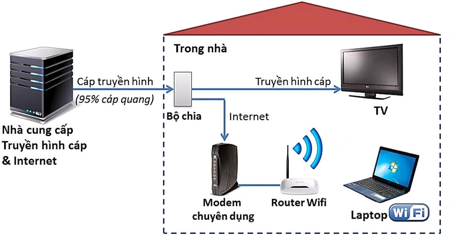

## OSI - LAN - WAN - TCP/IP Network:
#

1. Mô hình TCP/IP:

TCP/IP stands for Transmission Control Protocol/Internet Protocol and is a suite of communication protocols used to interconnect network devices on the internet. TCP/IP is also used as a communications protocol in a private computer network (an intranet or extranet).

Mô hình TCP/IP Network được chia ra gồm 4 lớp:

#
* Lớp Acess Network (Physical Layer):

In order to define what is meant by a physical medium, let us reflect on the brief life of a bit. Consider a
bit traveling from one end system, through a series of links and routers, to another end system.  The source end system first transmits
the bit, and shortly thereafter the first router in the series receives the bit; the first router then transmits
the bit, and shortly thereafter the second router receives the bit; and so on. Thus our bit, when traveling
from source to destination, passes through a series of transmitter-receiver pairs. For each transmitter-
receiver pair, the bit is sent by propagating electromagnetic waves or optical pulses across a physical
medium.

Thông thuồng sẽ có 2 loại là Guided Media và Unguided media:
*  With guided
media, the waves are guided along a solid medium, such as a fiber-optic cable, a twisted-pair copper
wire, or a coaxial cable. 
* With unguided media, the waves propagate in the atmosphere and in outer
space, such as in a wireless LAN or a digital satellite channel.

Một số Guided Media (cáp) thông thường sử dụng:

* Twisted-pair copper wire: Đây là loại rẻ nhất và thông thường đươc sử dụng hiện tại. Data rates for
LANs using twisted pair today range from 10 Mbps to 10 Gbps. Được sử dụng trong kết nối mạng LAN hay trong công nghệ DSL 
* Coaxial Cable: Thường được sử dụng nhiều trong cáp TV hay cáp kết nối Internet, tốc độ đạt được 10Mbps

* Fiber Optics: An optical fiber is a strand of glass that is as thin as a human hair. This strand is designed to carry information using pulses of light emitted by a laser. An optical fiber is a complex structure that consists of three layers.

https://www.coherent.com/news/glossary/optical-fibers  
Một số Unguided Media thông thường được sử dụng: 
Radio channels carry signals in the electromagnetic spectrum. They are an attractive medium because
they require no physical wire to be installed, can penetrate walls, provide connectivity to a mobile user,
and can potentially carry a signal for long distances.
* Terrestrial radio channels can be broadly classified into three groups: those that operate over very short
distance (e.g., with one or two meters); those that operate in local areas, typically spanning from ten to a few hundred meters.
* Sattelite Radio Channels: A communication satellite links two or more Earth-based microwave transmitter/ receivers, known as
ground stations. There are 2 types: geostationary satellites and low-earth orbiting. 
#

* Lớp Access Network (Data-Linker):

DSL, FTTH, Switch Ethernet (AON), ONT(PON)

WIFI, Ethernet, Zigbee, LoRaWan

Đây là lớp trung gian trong việc truyền dữ liệu. Nó xác định cách định dạng data được truyền đi bởi lớp physical. Lớp này cung cấp kết nối node-to-node, với nodes bao gồm hosts, routers, switches, WIFI AP,...

Consider sending a
datagram from one of the wireless hosts to one of the servers. This datagram will actually pass through
six links: a WiFi link between sending host and WiFi access point, an Ethernet link between the access
point and a link-layer switch; a link between the link-layer switch and the router, a link between the two
routers; an Ethernet link between the router and a link-layer switch; and finally an Ethernet link between
the switch and the server. Over a given link, a transmitting node encapsulates the datagram in a link-
layer frame and transmits the frame into the link

3 nhiệm vụ chính của lớp Data-link là:

* **Framing**. Almost all link-layer protocols encapsulate each network-layer datagram within a link-layer
frame before transmission over the link. A frame consists of a data field, in which the network-layer
datagram is inserted, and a number of header fields.
* **Link access**. A medium access control (MAC) protocol specifies the rules by which a frame is
transmitted onto the link. For point-to-point links that have a single sender at one end of the link and
a single receiver at the other end of the link, the MAC protocol is simple (or nonexistent)—the sender
can send a frame whenever the link is idle. 
* **Reliable delivery**. When a link-layer protocol provides reliable delivery service, it guarantees to
move each network-layer datagram across the link without error. Recall that certain transport-layer
protocols (such as TCP) also provide a reliable delivery service. Similar to a transport-layer reliable
delivery service, a link-layer reliable delivery service can be achieved with acknowledgments and
retransmissions
* **Error detection and correction**. The link-layer hardware in a receiving node can incorrectly decide
that a bit in a frame is zero when it was transmitted as a one, and vice versa. Such bit errors are
introduced by signal attenuation and electromagnetic noise. Because there is no need to forward a
datagram that has an error, many link-layer protocols provide a mechanism to detect such bit errors.

Một số ví dụ về các thiết bị và công cụ ở lơp DataLink: 

_ DSL: 

_Ethernet Switch: 

_ PON:

#
* Lớp Network:

The primary role of the network layer is deceptively simple—to move packets from a sending host to a
receiving host. To do so, two important network-layer functions can be identified:

* **Forwarding**. When a packet arrives at a router’s input link, the router must move the packet to the
appropriate output link. 
* **Routing**. The network layer must determine the route or path taken by packets as they flow from a
sender to a receiver.

2 nhiệm vụ này được thực hiện thông qua forwarding table với 2 tác vụ khác là Control plane (routing) và Data plane (forwarding).

https://blog.ipspace.net/2013/08/management-control-and-data-planes-in.html

Mục đích cần phải đạt được trong lớp này là:

_ **Guaranteed delivery**. This service guarantees that a packet sent by a source host will eventually
arrive at the destination host.

_ **Guaranteed delivery with bounded delay**. This service not only guarantees delivery of the packet,
but delivery within a specified host-to-host delay bound (for example, within 100 msec).

_ **In-order packet delivery**. This service guarantees that packets arrive at the destination in the order
that they were sent.

_ **Guaranteed minimal bandwidth**. This network-layer service emulates the behavior of a
transmission link of a specified bit rate (for example, 1 Mbps) between sending and receiving hosts.
As long as the sending host transmits bits (as part of packets) at a rate below the specified bit rate,
then all packets are eventually delivered to the destination host.

_ **Security**. The network layer could encrypt all datagrams at the source and decrypt them at the
destination, thereby providing confidentiality to all transport-layer segments.
#
* Lớp Transport: 

Internet makes two distinct transport-layer protocols available to the application layer. 
One of these protocols is UDP (User Datagram Protocol), which provides an unreliable, connectionless
service to the invoking application.  The second of these protocols is TCP (Transmission Control
Protocol), which provides a reliable, connection-oriented service to the invoking application. When
designing a network application, the application developer must specify one of these two transport
protocols.

2 chức năng chính của lớp này là Multiplexing và Demultiplexing 

#
* Lớp Application:

Đây là lớp gần nhất với người dùng. Đây là lớp tương tác giữa ứng dụng và các lớp bên dưới. Một vài giao thức được sử dụng trong lớp  này: Telnet, FTP, SMTP, HTTPS, SSL,..

2. Mô hình OSI: 

The open systems interconnection (OSI) model is a conceptual model created by the International Organization for Standardization which enables diverse communication systems to communicate using standard protocols. In plain English, the OSI provides a standard for different computer systems to be able to communicate with each other.

Although the modern Internet does not strictly follow the OSI Model (it more closely follows the simpler Internet protocol suite), the OSI Model is still very useful for troubleshooting network problems. Whether it’s one person who can’t get their laptop on the Internet, or a website being down for thousands of users, the OSI Model can help to break down the problem and isolate the source of the trouble. If the problem can be narrowed down to one specific layer of the model, a lot of unnecessary work can be avoided.

Nhìn chung, các lớp Physical, Data Link, Network, Transport đều giống với mô hình TCP/IP. Tuy nhiên, ở lớp Application được tách ra thêm 2 bước nữa là Presentation và Session.

* Session Layer:

The session layer provides for delimiting and synchronization of
data exchange, including the means to build a checkpointing and recovery scheme.

* Presentation Layer: 

The role of the presentation layer is to provide services that allow communicating
applications to interpret the meaning of data exchanged. These services include data compression and
data encryption (which are self-explanatory) as well as data description (which frees the applications
from having to worry about the internal format in which data are represented/stored—formats that may
differ from one computer to another) 

* Sự khác biệt giữa mô hình TCP/IP và OSI:

Đầu tiên, OSI là 1 mô hình mang tính lý thuyết và thiên về để tìm hiểu cách 1 máy tính nhận và xử lý dữ liệu thế nào. Mô hình TCP/IP là mô hình được sử dụng nhiều trong các giao thức liên quan đến kết nối mạng.

Tiếp đến, số lớp Layer của mô hình TCP/IP ít hơn mô hình OSI. Đó là do sự kết hợp của nhiều lớp vào 1 lớp.
Vơi việc nhiều lớp cần thiết hơn, yêu cầu về phần cứng và các công cụ cũng là nhiều hơn. Số bit và thông tin cần xử lý khi đó cũng ít hơn.

(OSI Flow)

 (TCP/IP Flow)

Một điểm kém hơn giữa TCP/IP so với OSI, đó là TCP/IP cung cấp phương thức Connectionless(UDP) đồng thời Connection-Oriented(TCP) cho viêc truyền tải còn OSI là Connection-Oriented. Do đó, khi sử dụng phương thức TCP/IP người dùng cần cân nhắc phương thức phù hợp.

Mô hình OSI là mô hình ra sau mô hình TCP/IP và là 1 mô hình lý thuyết. OSI có thể là 1 mô hình khi phát triển đến tối ưu sẽ là hiệu quả hơn TCP/IP. Tuy nhiên, việc nghiên cứu và tạo ra thêm các phần cứng phù hợp với các yêu cầu của các lớp của OSI có thể sẽ đòi hỏi nhiều yêu tài nguyên hơn nhưng không chắc mang lại nhiều hiêu quả hơn TCP/IP.

3. LANs:

Hình bên dưới là cấu trúc cơ bản của 1 mạng LAN với các kết nối giữa các máy tính, thiết bị, server vào cùng 1 switch.

Switch có thể gọi là 1 đại diện cho mạng LAN, và là phương thức Data Link trong mô hình OSI. Chúng không thể hiểu những vấn đề như IP hay tương tự ở những lớp trên. Thay vào đó, chúng sẽ sử dụng link-layer addressing với phương thức Address Resolution Protocol(ARP).

* Link Layer Addressing và ARP:

a. Link Layer Addressing:

Link-layer address(hay được gọi với LAN address, a
physical address, or a MAC address) được lưu trong adapters (network interfaces).

_ An adapter’s MAC address has a flat structure (as opposed to a hierarchical structure) and doesn’t
change no matter where the adapter goes.  _When an adapter wants to send a frame to some destination adapter, the sending adapter inserts the
destination adapter’s MAC address into the frame and then sends the frame into the LAN. _Thus, an adapter may receive a frame that isn’t
addressed to it. Thus, when an adapter receives a frame, it will check to see whether the destination
MAC address in the frame matches its own MAC address.  _If there is a match, the adapter extracts the
enclosed datagram and passes the datagram up the protocol stack. If there isn’t a match, the adapter
discards the frame, without passing the network-layer datagram up.  _
However, sometimes a sending adapter does want all the other adapters on the LAN to receive and
process the frame it is about to send. In this case, the sending adapter inserts a special **MAC broadcast
address** into the destination address field of the frame

b. ARP:

Because there are both network-layer addresses  and link-layer
addresses, there is a need to translate between them. For the Internet, this is
the job of the Address Resolution Protocol (ARP).

(*Lý do cần sử dụng và chuyển hóa sang địa chỉ MAC: do tồn tại nhiều loại network-layer address, tốn dung lượng RAM khi phải lưu và thay đổi khi thay đổi vị trí)

Quá trình thực hiện:  
_ Ban đầu, sau khi ARP resolve địa chỉ IP từ điểm gốc, 1 ARP packet sẽ được gửi đi từ điểm bắt đầu đến điểm kết thúc, để xác định địa chỉ MAC của điểm đich. Những địa chỉ MAC này sẽ được lưu vào ARP table để tiếp tục sử dụng trong 1 thời gian TTL 
_ Sau khi nhận được địa chỉ đích từ các điểm đến, adapter sẽ tạo 1 link-layer frame chứa MAC address điểm đích và gửi frame ấy lên LAN.

Một vài điểm lưu vê ARP: 
_ ARP message sẽ được gửi trong 1 broadcast frame và trả lời với 1 standard frame.   _ ARP is plug-and-play; that is, an ARP
table gets built automatically—it doesn’t have to be configured by a system administrator.  _ If a host
becomes disconnected from the subnet, its entry is eventually deleted from the other ARP tables in the
subnet.

* Ethernet: 

Ethernet là công nghệ LAN tốc độ cao sớm nhất được ra mắt, với giá thành rẻ và không phức tạp. Những sản phầm của Ethernet càng ngày càng cải thiện về data rates. 

Cấu trúc 1 frame của Ethernet: 

* Switched LANs:

Cách Switch vận hành:  
_ Forwarding and filtering: 

Filtering is the switch function that determines whether a frame should be forwarded to some interface
or should just be dropped.  Forwarding is the switch function that determines the interfaces to which a
frame should be directed, and then moves the frame to those interfaces.

_ Self Learning: 

Ban đầu switch table sẽ hoàn toán trống  
Với mỗi incoming frame, switch sẽ lưu vào MAC table (1)địa chỉ MAC điểm gốc, (2) số lượng kết nối (3) thời gian hiện tại. 

Switch sẽ tự động xóa địa chỉ nếu địa chỉ đó không được nhận hoặc gửi trong 1 khoảng thời gian. 

Đặc điểm của Switched LANs:

_ **Elimination of Collision**: The switches buffer frames and never transmit more than one frame on
a segment at any one time. As with a router, the maximum aggregate throughput of a switch is the
sum of all the switch interface rates. Thus, switches provide a significant performance improvement
over LANs with broadcast links. 
_ **Heterogenous links**: Because a switch isolates one link from another, the different links in the
LAN can operate at different speeds and can run over different media. 
_ **Management**: For example, if an adapter malfunctions and continually
sends Ethernet frames (called a jabbering adapter), a switch can detect the problem and internally
disconnect the malfunctioning adapter.

* Virtual LANs:

Một số hạn chế của Switch LANs có thể kể đến là:  
_ **Lack of traffic isolation**: LAN có thể xác định là truyền trong 1 broadcast, tuy nhiên có những thiết bị không cần truyền đến trong mạng 
_ **Inefficient use of switches**: xảy ra khi số lượng người là quá nhiều so với port có sẵn 
_ **Managing errors**: Khi có nhiều nhóm và các thành viên, việc chuyển giao các thành viên cũng sẽ dẫn đến việc thay đổi ở Switch cho phù hợp. 
Virtual VLANs có thể giải quyết những vấn đề trên. 

VLANs allows multiple virtual local
area networks to be defined over a single physical local area network infrastructure. Hosts within a
VLAN communicate with each other as if they (and no other hosts) were connected to the switch. In a
port-based VLAN, the switch’s ports (interfaces) are divided into groups by the network manager. Each
group constitutes a VLAN, with the ports in each VLAN forming a broadcast domain.

* Wireless LANs:

Wireless LANs là 1 trong những công nghệ kết nối mạng phổ biến nhất hiện nay với tiêu chuẩn IEEE 802.11 hay được biết đến là Wifi

The
fundamental building block of the 802.11 architecture is the basic service set (BSS). A BSS contains
one or more wireless stations and a central base station, known as an access point (AP) 

* Secured Wireless LANs:

Có 2 phương thức được áp dụng là Wired Equivalent Privacy (WEP) và IEEE 802.11i 

a. Wired Equivalent Privacy (WEP):

The IEEE 802.11 WEP protocol was designed to provide authentication and data encryption
between a host and a wireless access point using a symmetric shared key
approach. Authentication is
carried out as follows:
1. A wireless host requests authentication by an access point.
2. The access point responds to the authentication request with a 128-byte nonce value.
3. The wireless host encrypts the nonce using the symmetric key that it shares with the access
point.
4. The access point decrypts the host-encrypted nonce.

Thuật toán giải mã dữ liệu WEP:

4. WANs:

a. Switched WANs:

b. Point-to-point WANs:

c. Point-to-multipoints WANs: 

## Transport Layer_TCP Protocol_UDP Protocol:
#
1. Transport Layer: 
