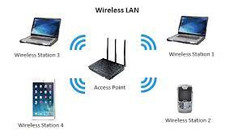

## OSI - LAN - WAN - TCP/IP Network:
#
1. Tổng quan OSI:

Mô hình OSI gồm 7 lớp chia ra làm 2 nhóm. 4 lớp bên dưới gọi là lớp thấp và 3 lớp bên trên gọi là lớp cao.

* Lớp 1 Physical Layer: 
In order to define what is meant by a physical medium, let us reflect on the brief life of a bit. Consider a
bit traveling from one end system, through a series of links and routers, to another end system.  The source end system first transmits
the bit, and shortly thereafter the first router in the series receives the bit; the first router then transmits
the bit, and shortly thereafter the second router receives the bit; and so on. Thus our bit, when traveling
from source to destination, passes through a series of transmitter-receiver pairs. For each transmitter-
receiver pair, the bit is sent by propagating electromagnetic waves or optical pulses across a physical
medium.
Thông thuồng sẽ có 2 loại là Guided Media và Unguided media:
    *  With guided
media, the waves are guided along a solid medium, such as a fiber-optic cable, a twisted-pair copper
wire, or a coaxial cable. 
    * With unguided media, the waves propagate in the atmosphere and in outer
space, such as in a wireless LAN or a digital satellite channel.  
Một số Guided Media (cáp) thông thường sử dụng:
    * Twisted-pair copper wire: Đây là loại rẻ nhất và thông thường đươc sử dụng hiện tại. Data rates for
LANs using twisted pair today range from 10 Mbps to 10 Gbps. Được sử dụng trong kết nối mạng LAN hay trong công nghệ DSL 
    * Coaxial Cable: Thường được sử dụng nhiều trong cáp TV hay cáp kết nối Internet, tốc độ đạt được 10Mbps

    * Fiber Optics: An optical fiber is a strand of glass that is as thin as a human hair. This strand is designed to carry information using pulses of light emitted by a laser. An optical fiber is a complex structure that consists of three layers.

https://www.coherent.com/news/glossary/optical-fibers  
Một số Unguided Media thông thường được sử dụng: 
Radio channels carry signals in the electromagnetic spectrum. They are an attractive medium because
they require no physical wire to be installed, can penetrate walls, provide connectivity to a mobile user,
and can potentially carry a signal for long distances.
    * Terrestrial radio channels can be broadly classified into three groups: those that operate over very short
distance (e.g., with one or two meters); those that operate in local areas, typically spanning from ten to a few hundred meters.
    * Sattelite Radio Channels: A communication satellite links two or more Earth-based microwave transmitter/ receivers, known as
ground stations. There are 2 types: geostationary satellites and low-earth orbiting.  

* Lớp 2 Data-Linker:

DSL, FTTH, Switch Ethernet (AON), ONT(PON)

WIFI, Ethernet, Zigbee, LoRaWan

Đây là lớp trung gian trong việc truyền dữ liệu. Nó xác định cách định dạng data được truyền đi bởi lớp physical. Lớp này cung cấp kết nối node-to-node, với nodes bao gồm hosts, routers, switches, WIFI AP,...

Consider sending a
datagram from one of the wireless hosts to one of the servers. This datagram will actually pass through
six links: a WiFi link between sending host and WiFi access point, an Ethernet link between the access
point and a link-layer switch; a link between the link-layer switch and the router, a link between the two
routers; an Ethernet link between the router and a link-layer switch; and finally an Ethernet link between
the switch and the server. Over a given link, a transmitting node encapsulates the datagram in a link-
layer frame and transmits the frame into the link

3 nhiệm vụ chính của lớp Data-link là:

* **Framing**. Almost all link-layer protocols encapsulate each network-layer datagram within a link-layer
frame before transmission over the link. A frame consists of a data field, in which the network-layer
datagram is inserted, and a number of header fields.
* **Link access**. A medium access control (MAC) protocol specifies the rules by which a frame is
transmitted onto the link. For point-to-point links that have a single sender at one end of the link and
a single receiver at the other end of the link, the MAC protocol is simple (or nonexistent)—the sender
can send a frame whenever the link is idle. 
* **Reliable delivery**. When a link-layer protocol provides reliable delivery service, it guarantees to
move each network-layer datagram across the link without error. Recall that certain transport-layer
protocols (such as TCP) also provide a reliable delivery service. Similar to a transport-layer reliable
delivery service, a link-layer reliable delivery service can be achieved with acknowledgments and
retransmissions
* **Error detection and correction**. The link-layer hardware in a receiving node can incorrectly decide
that a bit in a frame is zero when it was transmitted as a one, and vice versa. Such bit errors are
introduced by signal attenuation and electromagnetic noise. Because there is no need to forward a
datagram that has an error, many link-layer protocols provide a mechanism to detect such bit errors.

Một số ví dụ về các thiết bị và công cụ ở lơp DataLink: 

_ DSL: 

_Ethernet Switch: 

_ PON:

* Lớp 3 Network:

The primary role of the network layer is deceptively simple—to move packets from a sending host to a
receiving host. To do so, two important network-layer functions can be identified:

* **Forwarding**. When a packet arrives at a router’s input link, the router must move the packet to the
appropriate output link. 
* **Routing**. The network layer must determine the route or path taken by packets as they flow from a
sender to a receiver.

2 nhiệm vụ này được thực hiện thông qua forwarding table với 2 tác vụ khác là Control plane (routing) và Data plane (forwarding).

https://blog.ipspace.net/2013/08/management-control-and-data-planes-in.html

Mục đích cần phải đạt được trong lớp này là:

_ **Guaranteed delivery**. This service guarantees that a packet sent by a source host will eventually
arrive at the destination host.

_ **Guaranteed delivery with bounded delay**. This service not only guarantees delivery of the packet,
but delivery within a specified host-to-host delay bound (for example, within 100 msec).

_ **In-order packet delivery**. This service guarantees that packets arrive at the destination in the order
that they were sent.

_ **Guaranteed minimal bandwidth**. This network-layer service emulates the behavior of a
transmission link of a specified bit rate (for example, 1 Mbps) between sending and receiving hosts.
As long as the sending host transmits bits (as part of packets) at a rate below the specified bit rate,
then all packets are eventually delivered to the destination host.

_ **Security**. The network layer could encrypt all datagrams at the source and decrypt them at the
destination, thereby providing confidentiality to all transport-layer segments.

* Lớp 4 Transport: 

Internet makes two distinct transport-layer protocols available to the application layer. 
One of these protocols is UDP (User Datagram Protocol), which provides an unreliable, connectionless
service to the invoking application.  The second of these protocols is TCP (Transmission Control
Protocol), which provides a reliable, connection-oriented service to the invoking application. When
designing a network application, the application developer must specify one of these two transport
protocols.

2 chức năng chính của lớp này là Multiplexing và Demultiplexing 

* Lớp 5 Session:

Đây là lớp chịu trách nhệm cho việc truyền tải ở những lớp sau cùng. Nó hình thành, quản lý 1 session. Đăng nhập vào network cũng được hoàn thành trong lớp này. 

Tóm gọn lại đây là 1 lớp thuộc về Application và cung cấp người dùng 1 khả năng truy cập vào mạng hay 1 thiết bị trong hệ thống truyền tải.

* Lớp 6 Presentation: 

Đây là lớp Phiên dịch của 1 mạng. Chuyển đổi những data thành 1 cấu trúc file mà người dùng có thể dễ dàng tiếp cận. Như jpeg và gif đối với image; mp3, mp4 đối với video. 

Giải mã và nén dữ liệu là hoạt động chủ yếu ở lớp này.

* Lớp 7 Application:

Đây là lớp gần nhất với người dùng. Đây là lớp tương tác giữa ứng dụng và các lớp bên dưới. Một vài giao thức được sử dụng trong lớp  này: Telnet, FTP, SMTP, HTTPS, SSL,..

2. TCP/IP Network: 

3. LAN:

https://www.cisco.com/c/en/us/products/switches/what-is-a-lan-local-area-network.html

4. WAN:

https://www.cisco.com/c/en/us/products/switches/what-is-a-wan-wide-area-network.html

## Transport Layer_TCP Protocol_UDP Protocol:
#
1231231212